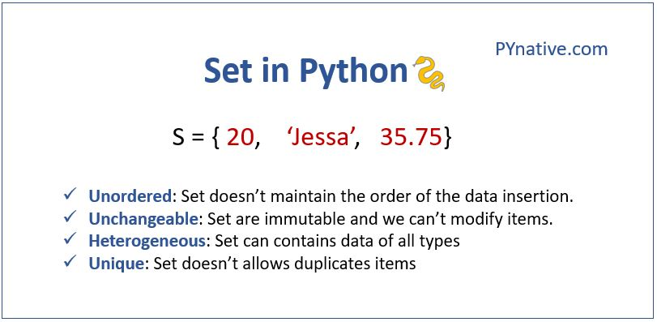
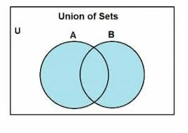
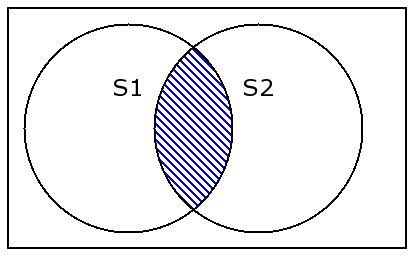

# Sets

Sets in Data Structure is used to store multiple items in a single variable. They map data to an index based on a hashing function. Sets do not have duplicate values. This is why sets are recommended in the real world to get unique values from a group of values and to find similar items and specific items.

``` python
names = {'Melanie', 'Russell', 'Melanie', 'Darren', 'Harold'}

print (names) 

#Results
# {Melanie, Russell, Darren, Harold}
```

*Items in a set are written inbetween two curly brackets*




`Example: set = {'Melanie', 12, (1,2,3), True}

## ADD & REMOVING Items to/from a SET

Just like every other data storage types, Items in a list can be added and removed. In sets, we can add values using the .add() function and the .remove() function

`Examples`

``` python
names = {'Water', 'Melon', 'Sugar', 'High'}

#Add item. This takes only one argument
names.add('hye')

#Remove
name.remove('Melon')

#Results
#{'High', 'Water', 'Sugar', 'hye', 'Melon'} (In no particular order)
#{'High', 'Water', 'Sugar', 'hye'}

```


## How To Access Items
Now that we know a little bit about sets, You may be wondering how an item can be accessed since this is a little different from lists which have indexes and dictionaries that have keys.

Items in a set can be accessed using a for loop that can loop through the set, or an if statement to check is a specific value is present in the set. 

Example;

```python
names = {'Water', 'Melon', 'Sugar', 'High'}

for i in names: 
    print (i) #Water, Melon, Sugar, high

if 'Water' in name:
    print('TRUE')
else:
    print('FALSE')
#ANSWER: TRUE
```


## Joining Sets 
You may be asking "Now I know these things, how do I join sets to one another?" Ask no more. There are multiple ways sets can be joined to one another.

Lets take it one step at a time.

`UNION`:
Don't think too far! Union means to unite two sets. At least that how I think about it. It take the values in Set1 and the in Set2 and bring them together to form one set.



Let look at an example
```python
set1 = {'Water', 'Melon', 'Sugar', 'High'}
set2 = {1,2,3,4,5,6,7,8}

set3 = set1.union(set2)
print (set3)

#Results
#{1, 2, 3, 4, 5, 6, 7, 8, 'Sugar', 'Melon', 'High', 'Water'}
```

`UPDATE`:
This function on the other hand updates the information in one set with the information in another set

```python
set1 = {'Water', 'Melon', 'Sugar', 'High'}
set2 = {1,2,3,4,5,6,7,8}

set1.update(set2)
print (set1)

#RESULTS
#{1, 2, 3, 4, 5, 6, 7, 8, 'Sugar', 'Melon', 'High', 'Water'}
```

`INTERSECTION`:
This is different that the previous two we spoke about earlier. With interection, we are looking for only similar values present between the two sets




Examples:
```python
set1 = {'Water', 'Melon',3,'Sugar', 1,'High'}
set2 = {1,2,3, 'Sugar', 'High',7,8}

set3 = set1.intersection(set2)
print(set3)

#RESULTS
{1, 3, 'Sugar', 'High'}
```

## Characteristics of a Set
* No duplicate values 
* Makes it faster to add, remove, and adding 
* There is no specific order to which values are being added. This is due to the hashing function

## OTHER SETS METHODS

Methods              | Description| Performance|
-------------------  | ------------|------------- | 
clear()              | Removes all the elements from the set |O(1)|
copy()               | Returns a copy of the set| O(1)|
difference()         | Returns a set containing the difference between two or more sets|O(1)|
intersection_update()|  Removes the items in this set that are not present in other, specified set(s)|O(1)|

Not to Overwhelm you but these are some common methods that can be used. However there's more but these can just easily be found online depending on how you are wanting to manipulate the information.

Alright! Now that you are a professional at working with sets, lets work on a more hands on example and test your understanding so far.

## Example
```python

#Lets Create a function for union

def union(set1, set2):#From the reading, union requires 2 values

#Creat a new set
set3 = set()

#create a loop to iterate through incoming set1
for i in set1:
    set3.add(i) #add each individual value to new set3

#do the same for set 2
#create loop
for i in set2:
    set3.add(i)

#now we have all values in myset, we return it
return set3

set1 = {3,4,5,'f'}
set2 = {'r',4,6,78}

print(union(set1, set2))

#RESULTS
#{'f', 3, 4, 5, 6, 78, 'r'}
```
## EXCERCISE
* Create a an intersection function that can take two sets and create a new set using the similar values.

*Notes: After attempting the following for 30mins and you are unable to find a solution, refer to the the following link for guidiance: [Solution]test.py*
