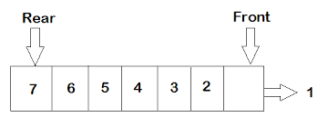
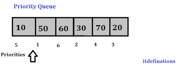
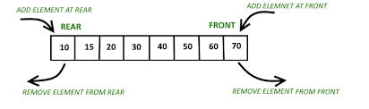
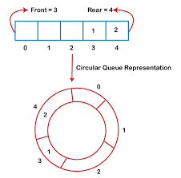

# Queues
Whenever you hear queue think of a line like the name implies. With Queues the order in which the operation is performed is followed. This order that is being followed states that the first in is the first out (FIFO). So lets say there is a line at your favorite resturant of 6 people and you are number seven. The first 6 people will get attended to first based on their position before you. First come first serve.


## Enqueue
Enqueue is the process by which an item is added to the back of a queue

## Dequeue
Dequeue is the process by which an item is removed from the from of a queue


## Types of Queues


There are four types of queues that we will be focusing on
* Simple Queues
* Priority Queues
* Double Ended Queues
* Circular Queues

## Simple Queues
This is a type of queue, the enqueue operaration takes place at the rear, whereas the dequeue operation takes place in the front




## Priority Queues
This is special kind of queue in which each item has a predefined priority of service. In this case, the item with the highest priority is dequeued before an item with the lowest priority



## Double Ended Queues
In this queue, the enqueue and dequeue operations takes place at both front and rear. This shows that items can be inserted and removed from both ends.



## Circular Queues
This is a type of queue were the last node points to the first nose thus creating a circular connection. It permits better memory utilization.




Operations | Description | Peformance
-------- | -------- | --------
enqueue | Adds value to the back of a queue by using the append function. Example: queue.append | O(1)
dequeue | removes value from the front of the queue by using the del or pop function. Example: del queue[3] | O(n)
size | returns the queue size by using len. Example: queuesize = len(queue) | O(1)


#Examples:

```python
#initialize queue

queue = [] 

#Add values to the queue
queue.append("Monday")
queue.append("Tuesday")
queue.append("Wednesday")
queue.append("Thursday")

print(queue)
#RESULT
#[Monday, Tuesday, Wednesday, Thursday]

#Remove Items from queue
queue.pop(0)

#RESULT
#['Tuesday', 'Wednesday', 'Thursday']


# View size of queue
length = len(queue)
print(lenght)
```

## Excercise

```python

class Queue:
    def __init__(self):
        self.queue = list()


    def add_to_queue(self, value):
        """Enqueue"""
        # Insert method to add element
        pass

    def remove_from_queue(self):
        """Dequeue"""
        #insert method to remove values
        pass

    def size(self):
        """size"""
        #insert method to find the length of values
       pass


#TEST
#Scenario: enqueue 5 values and dequeue 2 of the

print("------------TEST 1--------------")
queue = Queue()
queue.add_to_queue("Monday")
queue.add_to_queue("Tuesday")
queue.add_to_queue("Wednesday")
queue.add_to_queue("Thursday")

print(queue.size())

#RESULT = 4

print("----------TEST 2----------------")
removed = queue.remove_from_queue()
print(removed)
removed = queue.remove_from_queue()
print(removed)

#RESULT; Monday, Tuesday
```

*Notes: After attempting the following for 30mins and you are unable to find a solution, refer to the the following link for guidiance: [Solution](test2.py)*

