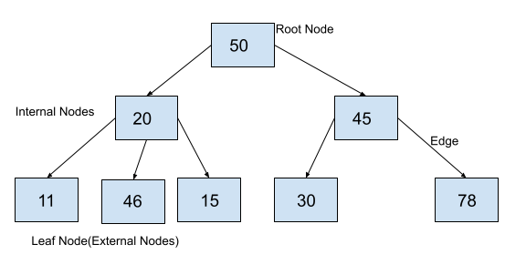
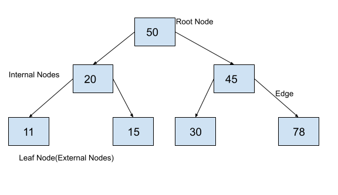
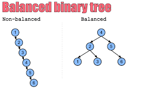
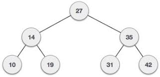

# Trees
Whenever you hear the word "TREE" in python, think of a tree which consists of a main stem that produces branches, and these branches themselves are able to produce leaves. A Tree is a Data structure in which items are connected in a hierachical manner. Each tree consists of a root node that can be used to access each item on the tree. It starts from the root nodes other node can could the children can also be contained.




### Parts of Tree

**Root Node:** This is the topmost node of any tree and each element can be accessed starting at the root node. In the diagram above, the root node is the is the node containg the value 50.

**Parent Node:** This is any node that references the current node. Examples values 50, 20 and 45 are parents nodes.

**child Node:** Any node being referenced by a parent node is a child node. in this case, 20 and are children to 50, 11, 46, 15 are children to 20 and so forth.

**Edge:** This is the reference through which a parent node is connected to a child node.

**Leaf Node:** Thes are the nodes in the tree that have no children.

**Internal Nodes:** These are the nodes that have at least one child. So this inclued 50, 20, 45.

## Binary Trees
Binary Tree is a type of tree in data structure in which each node can only have a maximum of 2 children. So the nodes can have either 0,1,2 or three children.

Below is an example of a binary tree




## Binary Search Trees
With binary search tree, the nodes follow the below-mentioned properties:

* The values of the key of the left subtree is less than the value of its parent node's key

* The valie of the key of the right sub-tree is greater than or equal to the value of its parent root


## Balanced Binary Search
A balanced binary tree, also referred to as a height-balanced binary tree, is defined as a binary tree in which the height of the left and right subtree of any node differ by not more than 1.





Operations | Description | Peformance
-------- | -------- | --------
insert(value) | 	Insert a value into the tree.| O(log n)
remove(value) | 	Remove a value from the tree.| O(log n) 
traverse_forward | Visit all objects from smallest to largest. | O(n)
traverse_reverse | Visit all objects from largest to smallest. | O(n)
height(node)| Determine the height of a node. If the height of the tree is needed, the root node is provided | O(n)
size() | Returns true if the root node is empty. This can also be done by checking the size for 0. | O(1)

## Importance
* Trees are important because they mimick a yes/no decision making process
* They help with sorting list data, with a representation of how they relate to each other

#Examples:

```python
Example 1
      7
    /   \
  6       8

Binary tree [7,6,8]. It should return True.

Example 2
      6
    /   \
  7       8

Binary tree [6,7,8]. It should return False.
```

### Solution
```python
    class TreeNode(object):
    def __init__(self, x):
        self.val = x
        self.left = None
        self.right = None

def is_BST(root):
    stack = []
    prev = None
    
    while root or stack:
        while root:
            stack.append(root)
            root = root.left
        root = stack.pop()
        if prev and root.val <= prev.val:
            return False
        prev = root
        root = root.right
    return True

root = TreeNode(2)  
root.left = TreeNode(1)  
root.right = TreeNode(3) 
 
result = is_BST(root)
print(result)

root = TreeNode(1)  
root.left = TreeNode(2)  
root.right = TreeNode(3) 
 
result = is_BST(root)
print(result)


#RESULT

#True
# False
```
## Excercise
Create a binary search tree and insert data like the image below. Then print the node with corresponding left and right nodes if any.




```python

#TEST CASES 

root= insert(None,27)
insert(root,14)
insert(root,35)
insert(root,10)
insert(root,19)
insert(root,31)
insert(root,42)

#Excpected output

Root Node is: 15
left child of node is: 10
right child of node is: 25

Node is: 10
left child of node is: 6
right child of node is: 14

Node is: 25
left child of node is: 20
right child of node is: 60

Node is: 6
left child of node is: None
right child of node is: None

Node is: 14
left child of node is: None
right child of node is: None

Node is: 20
left child of node is: None
right child of node is: None

Node is: 60
left child of node is: None
right child of node is: None
```

*Notes: When you are done, please compare your code to a possible solution  [here](treessolution.py)*